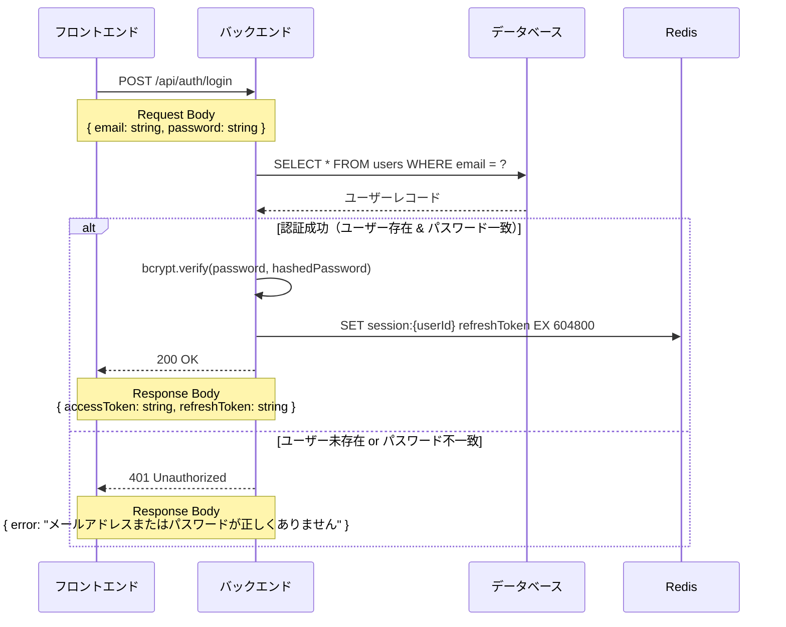
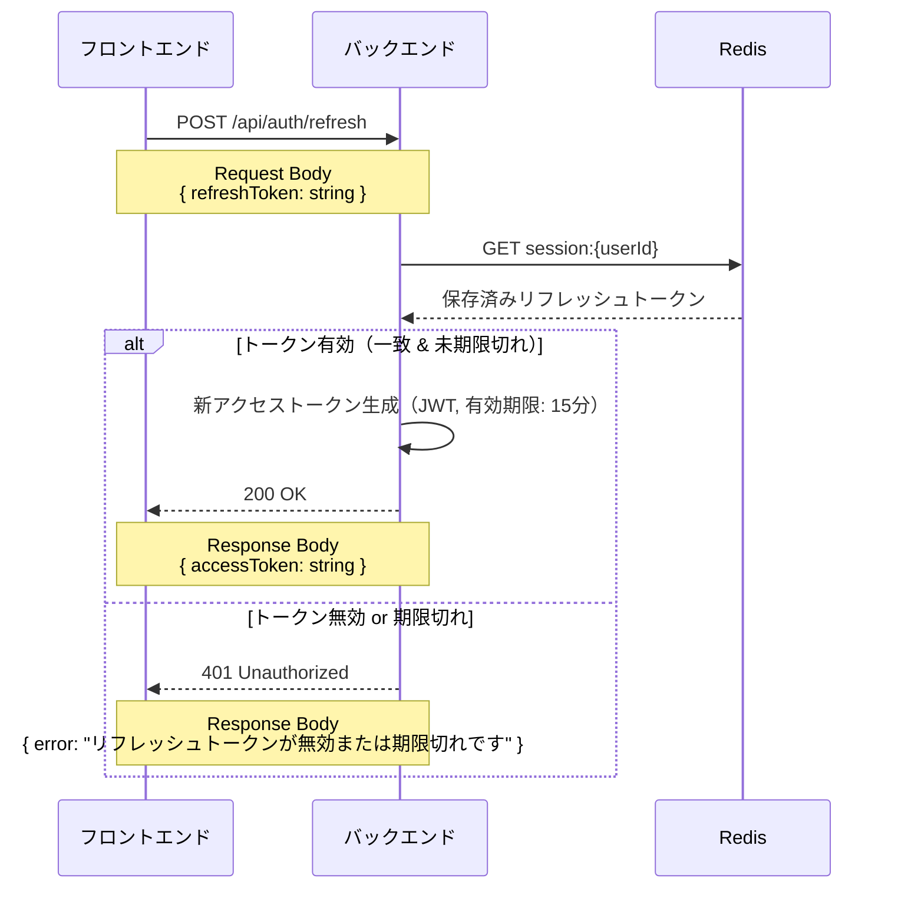
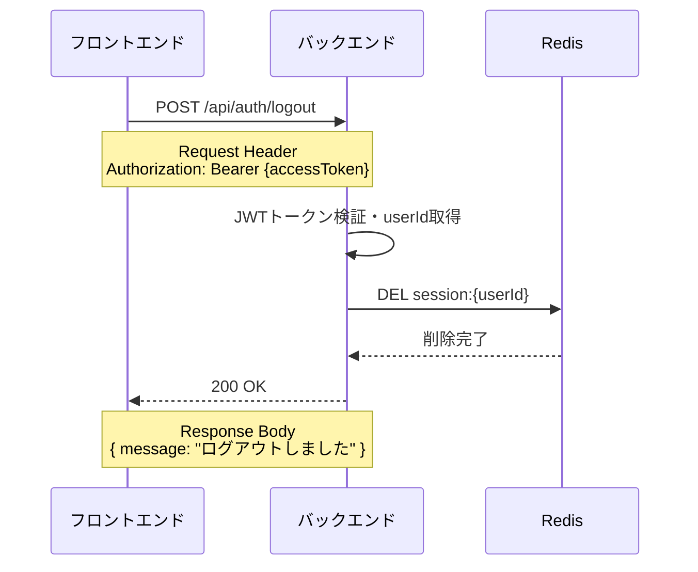

# 認証 API シーケンス図

## 1. ログイン

**`POST /api/auth/login`**

```mermaid
sequenceDiagram
    participant FE as フロントエンド
    participant BE as バックエンド
    participant DB as データベース
    participant Cache as Redis

    FE->>BE: POST /api/auth/login
    note over FE,BE: Request Body<br/>{ email: string, password: string }

    BE->>DB: SELECT * FROM users WHERE email = ?
    DB-->>BE: ユーザーレコード

    alt 認証成功（ユーザー存在 & パスワード一致）
        BE->>BE: bcrypt.verify(password, hashedPassword)
        BE->>Cache: SET session:{userId} refreshToken EX 604800
        BE-->>FE: 200 OK
        note over BE,FE: Response Body<br/>{ accessToken: string, refreshToken: string }
    else ユーザー未存在 or パスワード不一致
        BE-->>FE: 401 Unauthorized
        note over BE,FE: Response Body<br/>{ error: "メールアドレスまたはパスワードが正しくありません" }
    end
```

---

## 2. トークン更新（リフレッシュ）

**`POST /api/auth/refresh`**

```mermaid
sequenceDiagram
    participant FE as フロントエンド
    participant BE as バックエンド
    participant Cache as Redis

    FE->>BE: POST /api/auth/refresh
    note over FE,BE: Request Body<br/>{ refreshToken: string }

    BE->>Cache: GET session:{userId}
    Cache-->>BE: 保存済みリフレッシュトークン

    alt トークン有効（一致 & 未期限切れ）
        BE->>BE: 新アクセストークン生成（JWT, 有効期限: 15分）
        BE-->>FE: 200 OK
        note over BE,FE: Response Body<br/>{ accessToken: string }
    else トークン無効 or 期限切れ
        BE-->>FE: 401 Unauthorized
        note over BE,FE: Response Body<br/>{ error: "リフレッシュトークンが無効または期限切れです" }
    end
```

---

## 3. ログアウト

**`POST /api/auth/logout`**

```mermaid
sequenceDiagram
    participant FE as フロントエンド
    participant BE as バックエンド
    participant Cache as Redis

    FE->>BE: POST /api/auth/logout
    note over FE,BE: Request Header<br/>Authorization: Bearer {accessToken}

    BE->>BE: JWTトークン検証・userId取得
    BE->>Cache: DEL session:{userId}
    Cache-->>BE: 削除完了

    BE-->>FE: 200 OK
    note over BE,FE: Response Body<br/>{ message: "ログアウトしました" }
```
