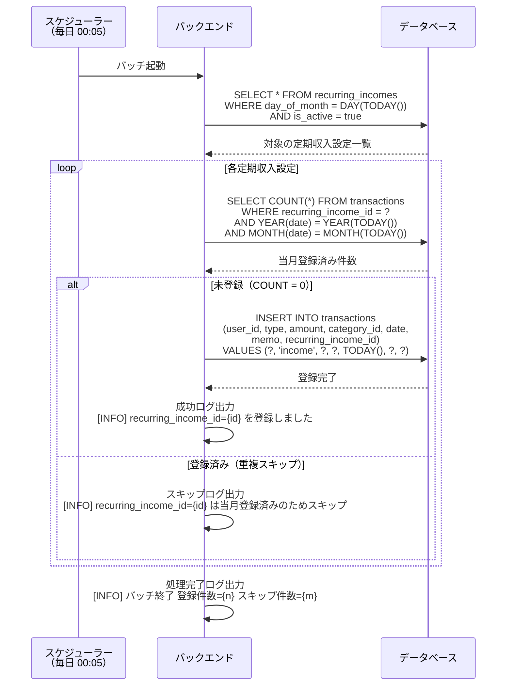

# 定期収入自動反映バッチ シーケンス図

## 概要

| 項目 | 内容 |
|---|---|
| バッチ名 | 定期収入自動反映バッチ |
| 実行タイミング | 毎日 00:05 |
| 処理内容 | `recurring_incomes` から当日が `day_of_month` の有効な設定を取得し、当月分の収入明細を自動登録 |
| 重複防止 | `transactions.recurring_income_id` と当月の組み合わせで既存チェック |

---

## 処理フロー

