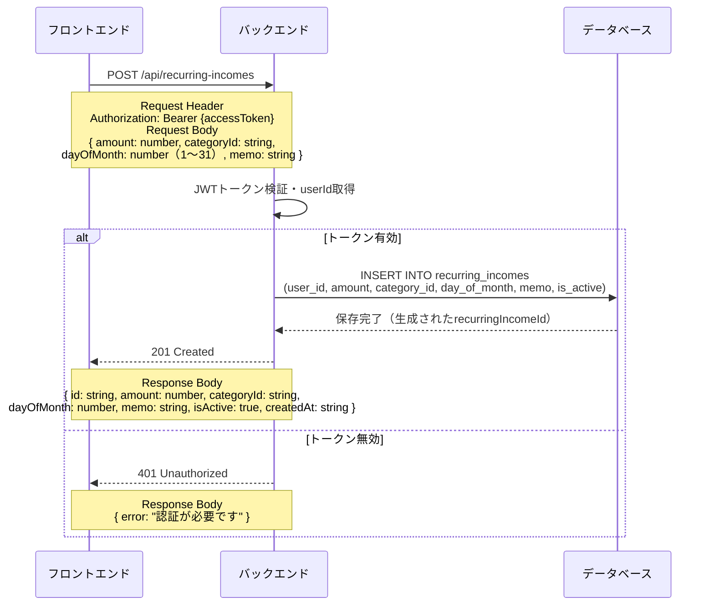
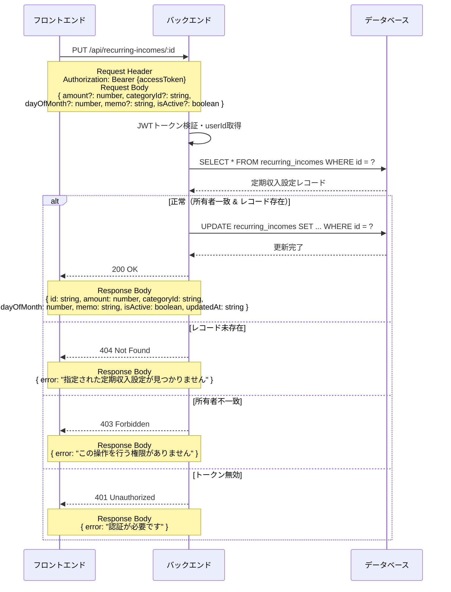

# 定期収入 API シーケンス図

## 1. 定期収入設定登録

**`POST /api/recurring-incomes`**

```mermaid
sequenceDiagram
    participant FE as フロントエンド
    participant BE as バックエンド
    participant DB as データベース

    FE->>BE: POST /api/recurring-incomes
    note over FE,BE: Request Header<br/>Authorization: Bearer {accessToken}<br/>Request Body<br/>{ amount: number, categoryId: string,<br/>  dayOfMonth: number（1〜31）, memo: string }

    BE->>BE: JWTトークン検証・userId取得

    alt トークン有効
        BE->>DB: INSERT INTO recurring_incomes<br/>(user_id, amount, category_id, day_of_month, memo, is_active)
        DB-->>BE: 保存完了（生成されたrecurringIncomeId）
        BE-->>FE: 201 Created
        note over BE,FE: Response Body<br/>{ id: string, amount: number, categoryId: string,<br/>  dayOfMonth: number, memo: string, isActive: true, createdAt: string }
    else トークン無効
        BE-->>FE: 401 Unauthorized
        note over BE,FE: Response Body<br/>{ error: "認証が必要です" }
    end
```

---

## 2. 定期収入設定更新・無効化

**`PUT /api/recurring-incomes/:id`**

```mermaid
sequenceDiagram
    participant FE as フロントエンド
    participant BE as バックエンド
    participant DB as データベース

    FE->>BE: PUT /api/recurring-incomes/:id
    note over FE,BE: Request Header<br/>Authorization: Bearer {accessToken}<br/>Request Body<br/>{ amount?: number, categoryId?: string,<br/>  dayOfMonth?: number, memo?: string, isActive?: boolean }

    BE->>BE: JWTトークン検証・userId取得
    BE->>DB: SELECT * FROM recurring_incomes WHERE id = ?
    DB-->>BE: 定期収入設定レコード

    alt 正常（所有者一致 & レコード存在）
        BE->>DB: UPDATE recurring_incomes SET ... WHERE id = ?
        DB-->>BE: 更新完了
        BE-->>FE: 200 OK
        note over BE,FE: Response Body<br/>{ id: string, amount: number, categoryId: string,<br/>  dayOfMonth: number, memo: string, isActive: boolean, updatedAt: string }
    else レコード未存在
        BE-->>FE: 404 Not Found
        note over BE,FE: Response Body<br/>{ error: "指定された定期収入設定が見つかりません" }
    else 所有者不一致
        BE-->>FE: 403 Forbidden
        note over BE,FE: Response Body<br/>{ error: "この操作を行う権限がありません" }
    else トークン無効
        BE-->>FE: 401 Unauthorized
        note over BE,FE: Response Body<br/>{ error: "認証が必要です" }
    end
```
