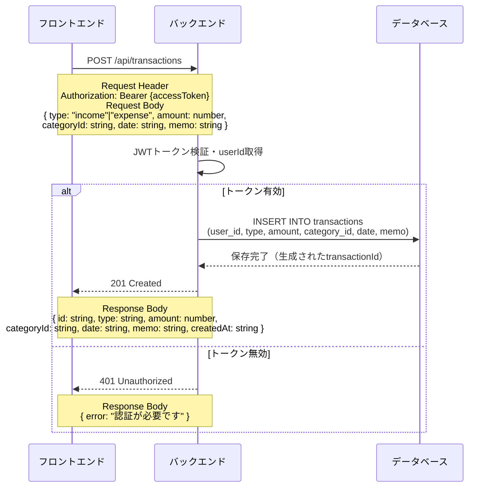
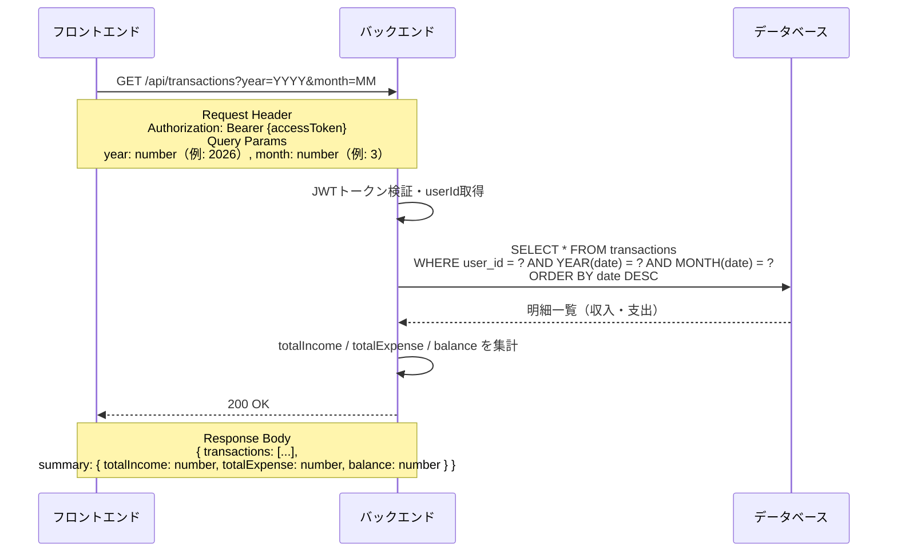
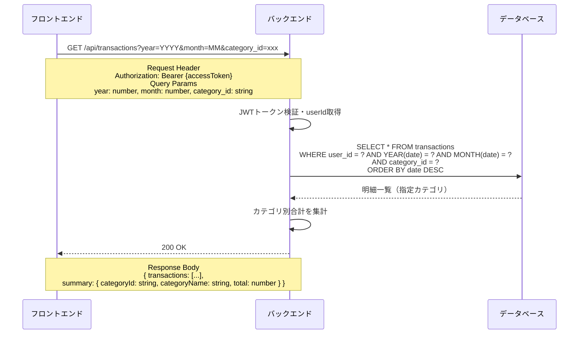

# 明細 API シーケンス図

## 1. 明細登録

**`POST /api/transactions`**

---

## 2. 明細一覧取得（月ごと）

**`GET /api/transactions?year=YYYY&month=MM`**

---

## 3. 明細一覧取得（カテゴリごと）

**`GET /api/transactions?year=YYYY&month=MM&category_id=xxx`**

