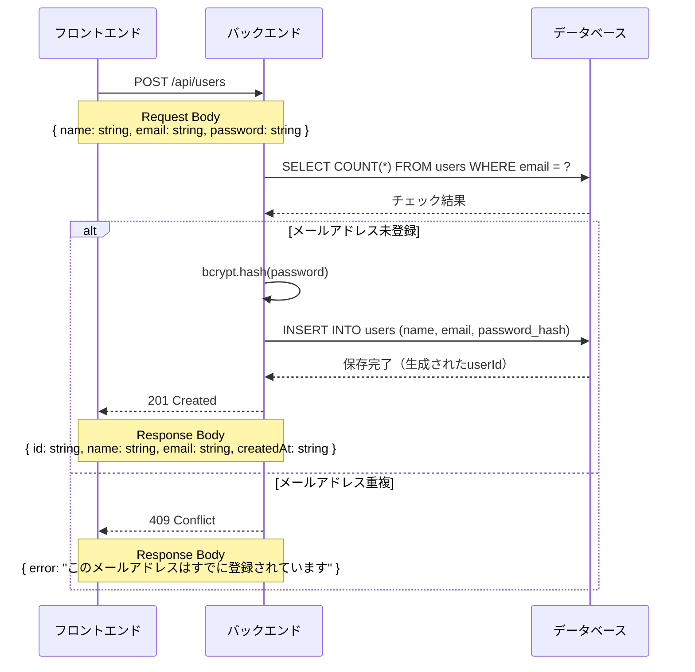

# ユーザー API シーケンス図

## 1. ユーザー登録

**`POST /api/users`**

```mermaid
sequenceDiagram
    participant FE as フロントエンド
    participant BE as バックエンド
    participant DB as データベース

    FE->>BE: POST /api/users
    note over FE,BE: Request Body<br/>{ name: string, email: string, password: string }

    BE->>DB: SELECT COUNT(*) FROM users WHERE email = ?
    DB-->>BE: チェック結果

    alt メールアドレス未登録
        BE->>BE: bcrypt.hash(password)
        BE->>DB: INSERT INTO users (name, email, password_hash)
        DB-->>BE: 保存完了（生成されたuserId）
        BE-->>FE: 201 Created
        note over BE,FE: Response Body<br/>{ id: string, name: string, email: string, createdAt: string }
    else メールアドレス重複
        BE-->>FE: 409 Conflict
        note over BE,FE: Response Body<br/>{ error: "このメールアドレスはすでに登録されています" }
    end
```
