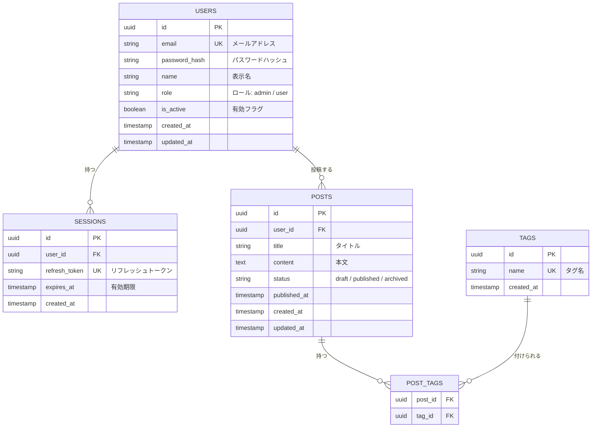

# ER図

## テーブル設計

## テーブル説明

| テーブル名 | 説明 |
|---|---|
| `users` | ユーザー情報 |
| `sessions` | 認証セッション（リフレッシュトークン管理） |
| `posts` | 投稿コンテンツ |
| `tags` | タグマスタ |
| `post_tags` | 投稿とタグの中間テーブル |

## インデックス設計

| テーブル | カラム | 種別 | 用途 |
|---|---|---|---|
| `users` | `email` | UNIQUE | ログイン検索 |
| `sessions` | `refresh_token` | UNIQUE | トークン検証 |
| `sessions` | `user_id` | INDEX | ユーザー別セッション取得 |
| `posts` | `user_id` | INDEX | ユーザー別投稿取得 |
| `posts` | `status, published_at` | INDEX | 公開記事一覧取得 |
