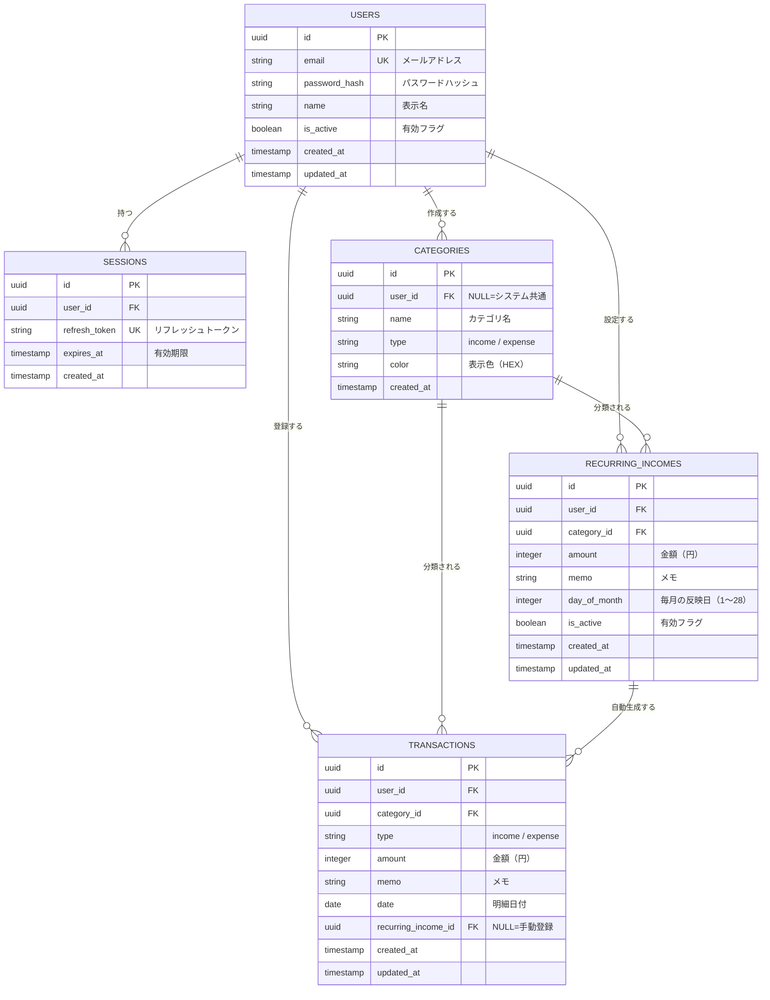

# ER図

## テーブル設計

## テーブル説明

| テーブル名 | 説明 |
|---|---|
| `users` | ユーザー情報 |
| `sessions` | 認証セッション（リフレッシュトークン管理） |
| `categories` | カテゴリマスタ（収入・支出。user_id=NULLはシステム共通） |
| `transactions` | 収支明細（手動登録・定期収入自動生成の両方） |
| `recurring_incomes` | 毎月の定期収入設定 |

## インデックス設計

| テーブル | カラム | 種別 | 用途 |
|---|---|---|---|
| `users` | `email` | UNIQUE | ログイン検索 |
| `sessions` | `refresh_token` | UNIQUE | トークン検証 |
| `sessions` | `user_id` | INDEX | ユーザー別セッション取得 |
| `transactions` | `user_id, date` | INDEX | 月別明細取得 |
| `transactions` | `user_id, category_id` | INDEX | カテゴリ別明細取得 |
| `transactions` | `recurring_income_id` | INDEX | 定期収入の重複チェック |
| `recurring_incomes` | `user_id, is_active` | INDEX | バッチ処理での対象取得 |
| `recurring_incomes` | `day_of_month` | INDEX | 反映日でのバッチ絞り込み |