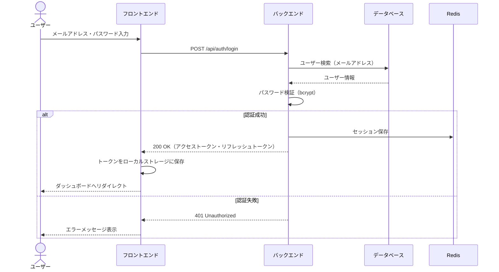
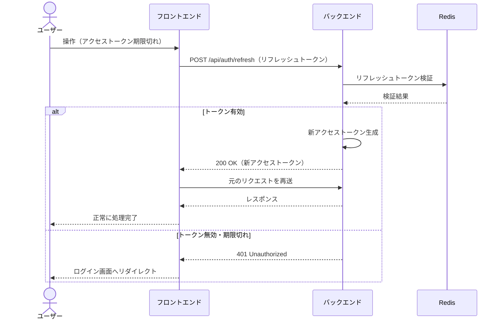
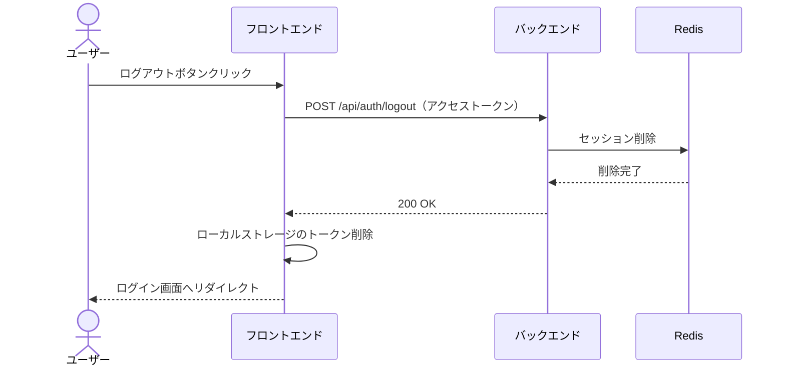

# 認証フロー シーケンス図

## 1. ログイン

```mermaid
sequenceDiagram
    actor User as ユーザー
    participant FE as フロントエンド
    participant BE as バックエンド
    participant DB as データベース
    participant Cache as Redis

    User->>FE: メールアドレス・パスワード入力
    FE->>BE: POST /api/auth/login
    BE->>DB: ユーザー検索（メールアドレス）
    DB-->>BE: ユーザー情報
    BE->>BE: パスワード検証（bcrypt）
    alt 認証成功
        BE->>Cache: セッション保存
        BE-->>FE: 200 OK（アクセストークン・リフレッシュトークン）
        FE->>FE: トークンをローカルストレージに保存
        FE-->>User: ダッシュボードへリダイレクト
    else 認証失敗
        BE-->>FE: 401 Unauthorized
        FE-->>User: エラーメッセージ表示
    end
```

## 2. トークン更新（リフレッシュ）

```mermaid
sequenceDiagram
    actor User as ユーザー
    participant FE as フロントエンド
    participant BE as バックエンド
    participant Cache as Redis

    User->>FE: 操作（アクセストークン期限切れ）
    FE->>BE: POST /api/auth/refresh（リフレッシュトークン）
    BE->>Cache: リフレッシュトークン検証
    Cache-->>BE: 検証結果
    alt トークン有効
        BE->>BE: 新アクセストークン生成
        BE-->>FE: 200 OK（新アクセストークン）
        FE->>BE: 元のリクエストを再送
        BE-->>FE: レスポンス
        FE-->>User: 正常に処理完了
    else トークン無効・期限切れ
        BE-->>FE: 401 Unauthorized
        FE-->>User: ログイン画面へリダイレクト
    end
```

## 3. ログアウト

```mermaid
sequenceDiagram
    actor User as ユーザー
    participant FE as フロントエンド
    participant BE as バックエンド
    participant Cache as Redis

    User->>FE: ログアウトボタンクリック
    FE->>BE: POST /api/auth/logout（アクセストークン）
    BE->>Cache: セッション削除
    Cache-->>BE: 削除完了
    BE-->>FE: 200 OK
    FE->>FE: ローカルストレージのトークン削除
    FE-->>User: ログイン画面へリダイレクト
```
