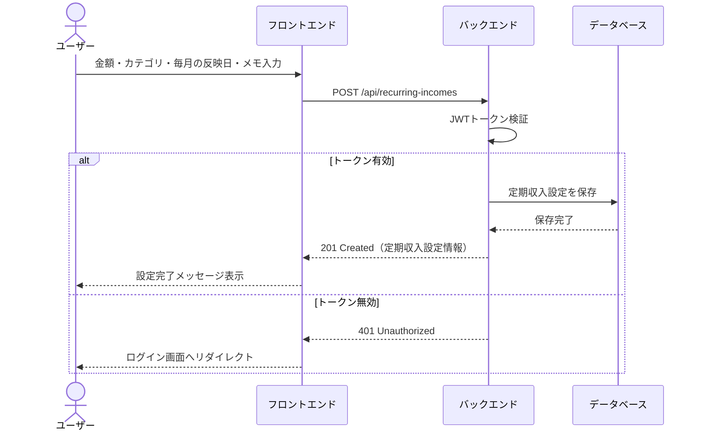
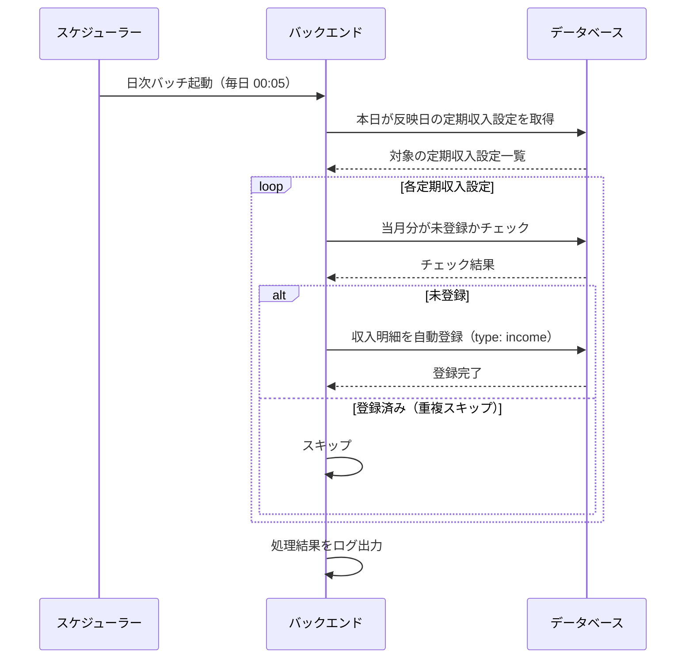
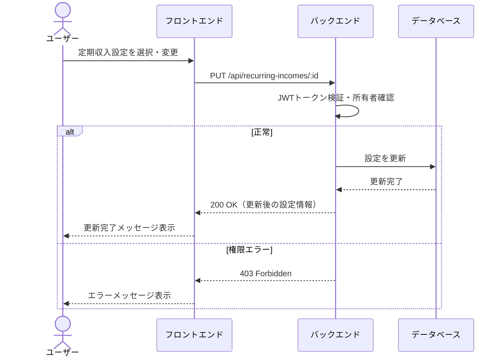

# 定期収入フロー シーケンス図

## 1. 定期収入設定

```mermaid
sequenceDiagram
    actor User as ユーザー
    participant FE as フロントエンド
    participant BE as バックエンド
    participant DB as データベース

    User->>FE: 金額・カテゴリ・毎月の反映日・メモ入力
    FE->>BE: POST /api/recurring-incomes
    BE->>BE: JWTトークン検証
    alt トークン有効
        BE->>DB: 定期収入設定を保存
        DB-->>BE: 保存完了
        BE-->>FE: 201 Created（定期収入設定情報）
        FE-->>User: 設定完了メッセージ表示
    else トークン無効
        BE-->>FE: 401 Unauthorized
        FE-->>User: ログイン画面へリダイレクト
    end
```

## 2. 定期収入の自動反映（バッチ処理）

```mermaid
sequenceDiagram
    participant Scheduler as スケジューラー
    participant BE as バックエンド
    participant DB as データベース

    Scheduler->>BE: 日次バッチ起動（毎日 00:05）
    BE->>DB: 本日が反映日の定期収入設定を取得
    DB-->>BE: 対象の定期収入設定一覧
    loop 各定期収入設定
        BE->>DB: 当月分が未登録かチェック
        DB-->>BE: チェック結果
        alt 未登録
            BE->>DB: 収入明細を自動登録（type: income）
            DB-->>BE: 登録完了
        else 登録済み（重複スキップ）
            BE->>BE: スキップ
        end
    end
    BE->>BE: 処理結果をログ出力
```

## 3. 定期収入設定の更新・無効化

```mermaid
sequenceDiagram
    actor User as ユーザー
    participant FE as フロントエンド
    participant BE as バックエンド
    participant DB as データベース

    User->>FE: 定期収入設定を選択・変更
    FE->>BE: PUT /api/recurring-incomes/:id
    BE->>BE: JWTトークン検証・所有者確認
    alt 正常
        BE->>DB: 設定を更新
        DB-->>BE: 更新完了
        BE-->>FE: 200 OK（更新後の設定情報）
        FE-->>User: 更新完了メッセージ表示
    else 権限エラー
        BE-->>FE: 403 Forbidden
        FE-->>User: エラーメッセージ表示
    end
```