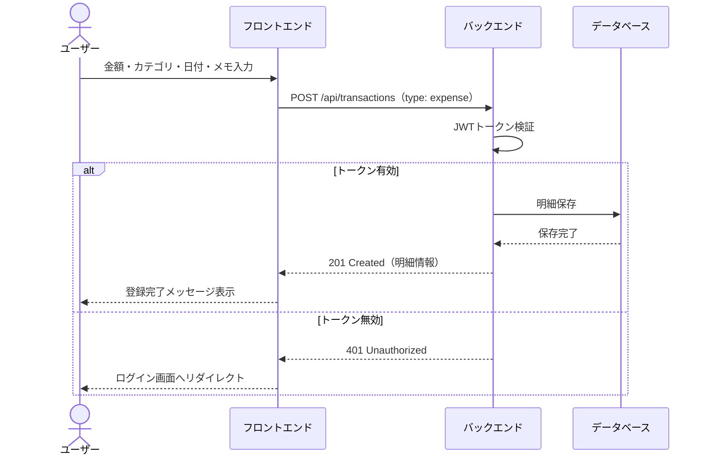
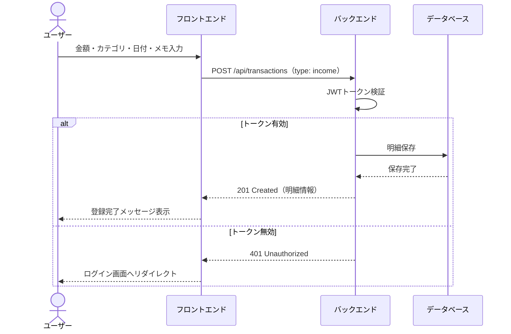
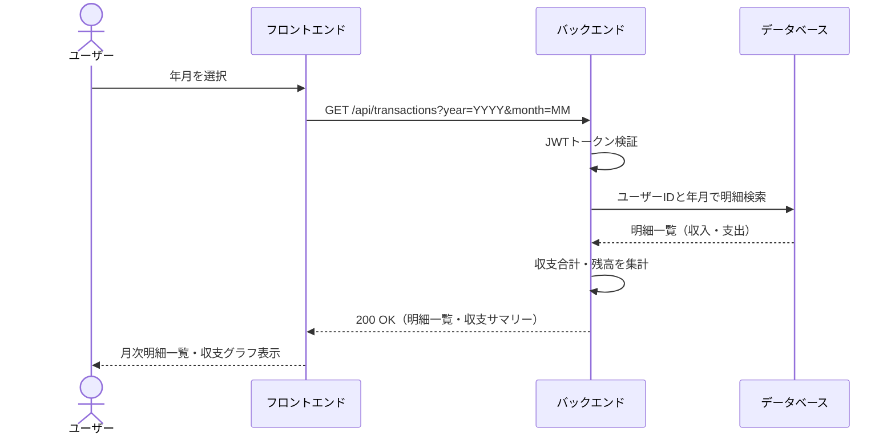
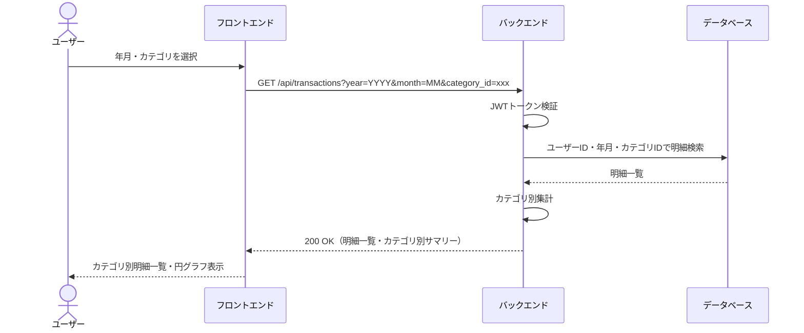

# 明細フロー シーケンス図

## 1. 支出登録

```mermaid
sequenceDiagram
    actor User as ユーザー
    participant FE as フロントエンド
    participant BE as バックエンド
    participant DB as データベース

    User->>FE: 金額・カテゴリ・日付・メモ入力
    FE->>BE: POST /api/transactions（type: expense）
    BE->>BE: JWTトークン検証
    alt トークン有効
        BE->>DB: 明細保存
        DB-->>BE: 保存完了
        BE-->>FE: 201 Created（明細情報）
        FE-->>User: 登録完了メッセージ表示
    else トークン無効
        BE-->>FE: 401 Unauthorized
        FE-->>User: ログイン画面へリダイレクト
    end
```

## 2. 収入登録

```mermaid
sequenceDiagram
    actor User as ユーザー
    participant FE as フロントエンド
    participant BE as バックエンド
    participant DB as データベース

    User->>FE: 金額・カテゴリ・日付・メモ入力
    FE->>BE: POST /api/transactions（type: income）
    BE->>BE: JWTトークン検証
    alt トークン有効
        BE->>DB: 明細保存
        DB-->>BE: 保存完了
        BE-->>FE: 201 Created（明細情報）
        FE-->>User: 登録完了メッセージ表示
    else トークン無効
        BE-->>FE: 401 Unauthorized
        FE-->>User: ログイン画面へリダイレクト
    end
```

## 3. 明細一覧表示（月ごと）

```mermaid
sequenceDiagram
    actor User as ユーザー
    participant FE as フロントエンド
    participant BE as バックエンド
    participant DB as データベース

    User->>FE: 年月を選択
    FE->>BE: GET /api/transactions?year=YYYY&month=MM
    BE->>BE: JWTトークン検証
    BE->>DB: ユーザーIDと年月で明細検索
    DB-->>BE: 明細一覧（収入・支出）
    BE->>BE: 収支合計・残高を集計
    BE-->>FE: 200 OK（明細一覧・収支サマリー）
    FE-->>User: 月次明細一覧・収支グラフ表示
```

## 4. 明細一覧表示（カテゴリごと）

```mermaid
sequenceDiagram
    actor User as ユーザー
    participant FE as フロントエンド
    participant BE as バックエンド
    participant DB as データベース

    User->>FE: 年月・カテゴリを選択
    FE->>BE: GET /api/transactions?year=YYYY&month=MM&category_id=xxx
    BE->>BE: JWTトークン検証
    BE->>DB: ユーザーID・年月・カテゴリIDで明細検索
    DB-->>BE: 明細一覧
    BE->>BE: カテゴリ別集計
    BE-->>FE: 200 OK（明細一覧・カテゴリ別サマリー）
    FE-->>User: カテゴリ別明細一覧・円グラフ表示
```
