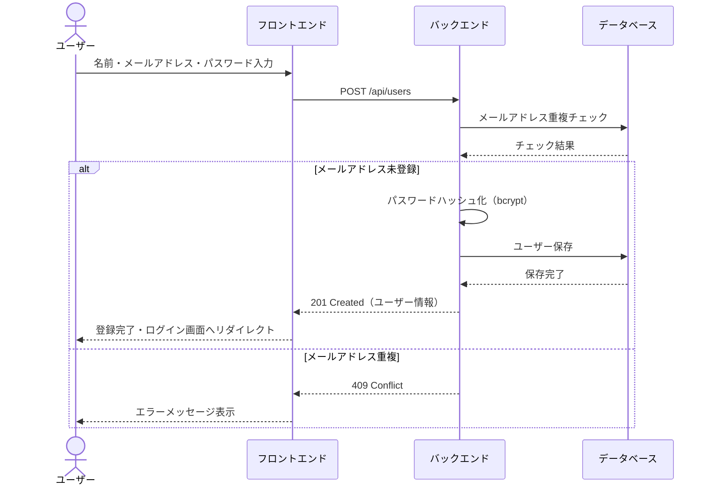

# ユーザー作成フロー シーケンス図

## 1. ユーザー登録

```mermaid
sequenceDiagram
    actor User as ユーザー
    participant FE as フロントエンド
    participant BE as バックエンド
    participant DB as データベース

    User->>FE: 名前・メールアドレス・パスワード入力
    FE->>BE: POST /api/users
    BE->>DB: メールアドレス重複チェック
    DB-->>BE: チェック結果
    alt メールアドレス未登録
        BE->>BE: パスワードハッシュ化（bcrypt）
        BE->>DB: ユーザー保存
        DB-->>BE: 保存完了
        BE-->>FE: 201 Created（ユーザー情報）
        FE-->>User: 登録完了・ログイン画面へリダイレクト
    else メールアドレス重複
        BE-->>FE: 409 Conflict
        FE-->>User: エラーメッセージ表示
    end
```
