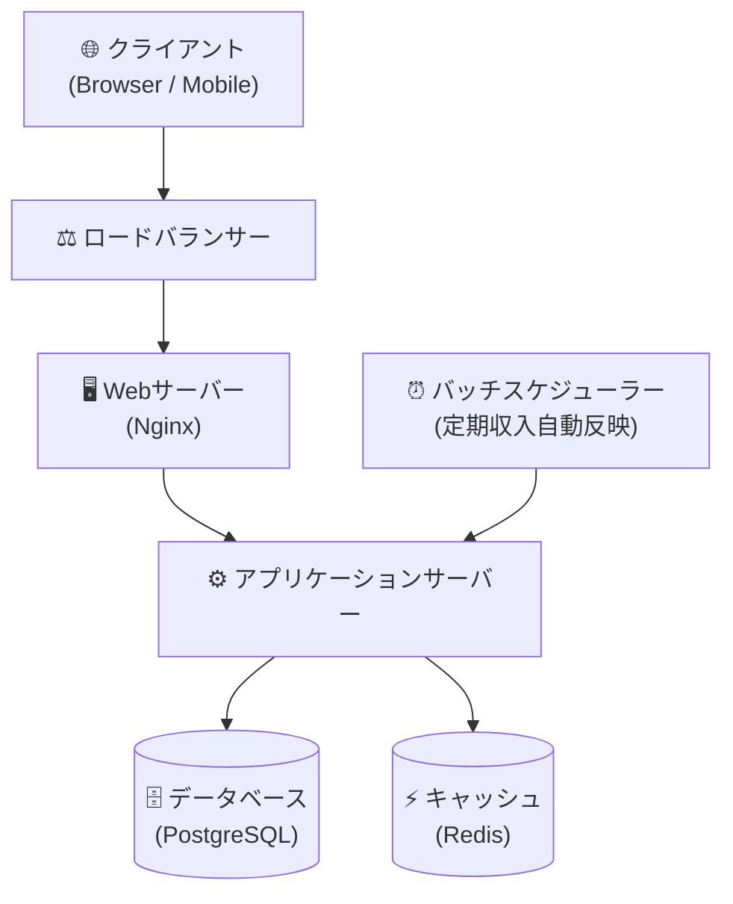

# システム設計書

## 1. システム概要

| 項目 | 内容 |
|---|---|
| システム名 | 家計簿アプリ |
| バージョン | 1.0.0 |
| 作成日 | 2026-02-18 |
| 最終更新日 | 2026-02-18 |

## 2. アーキテクチャ概要

## 3. 技術スタック

### フロントエンド
| 項目 | 技術 | バージョン |
|---|---|---|
| フレームワーク | Vue | 3.x |
| 言語 | TypeScript | 5.x |
| スタイリング | Tailwind CSS | 3.x |

### バックエンド
| 項目 | 技術 | バージョン |
|---|---|---|
| 言語 | Java | 21.x |
| フレームワーク | Spring Boot | 3.x |
| ORM | Hibernate | 6.x |

### インフラ
| 項目 | 技術 |
|---|---|
| クラウド | AWS |
| コンテナ | Docker / ECS |
| CI/CD | GitHub Actions |

## 4. コンポーネント設計

### 認証モジュール
- ユーザー登録・ログイン・ログアウト
- JWTトークン発行・検証
- リフレッシュトークンによるトークン更新

### 明細管理モジュール
- 収入・支出の登録・編集・削除
- 月別・カテゴリ別での絞り込み・集計
- 収支サマリー（合計収入・合計支出・残高）の計算

### カテゴリ管理モジュール
- システム共通カテゴリの提供
- ユーザー独自カテゴリの作成・編集・削除

### 定期収入モジュール
- 毎月の定期収入設定の登録・更新・無効化
- 日次バッチによる収入明細の自動生成
- 重複登録防止（当月分の二重生成をスキップ）

## 5. バッチ処理設計

### 定期収入自動反映バッチ
| 項目 | 内容 |
|---|---|
| 実行タイミング | 毎日 00:05 |
| 処理内容 | `recurring_incomes` から本日が `day_of_month` の有効な設定を取得し、当月分の収入明細を自動登録 |
| 重複防止 | `transactions.recurring_income_id` と当月の組み合わせで既存チェック |

## 6. デプロイ構成

## 7. 変更履歴

| バージョン | 日付 | 変更内容 | 担当者 |
|---|---|---|---|
| 1.0.0 | 2026-02-18 | 初版作成 | - |