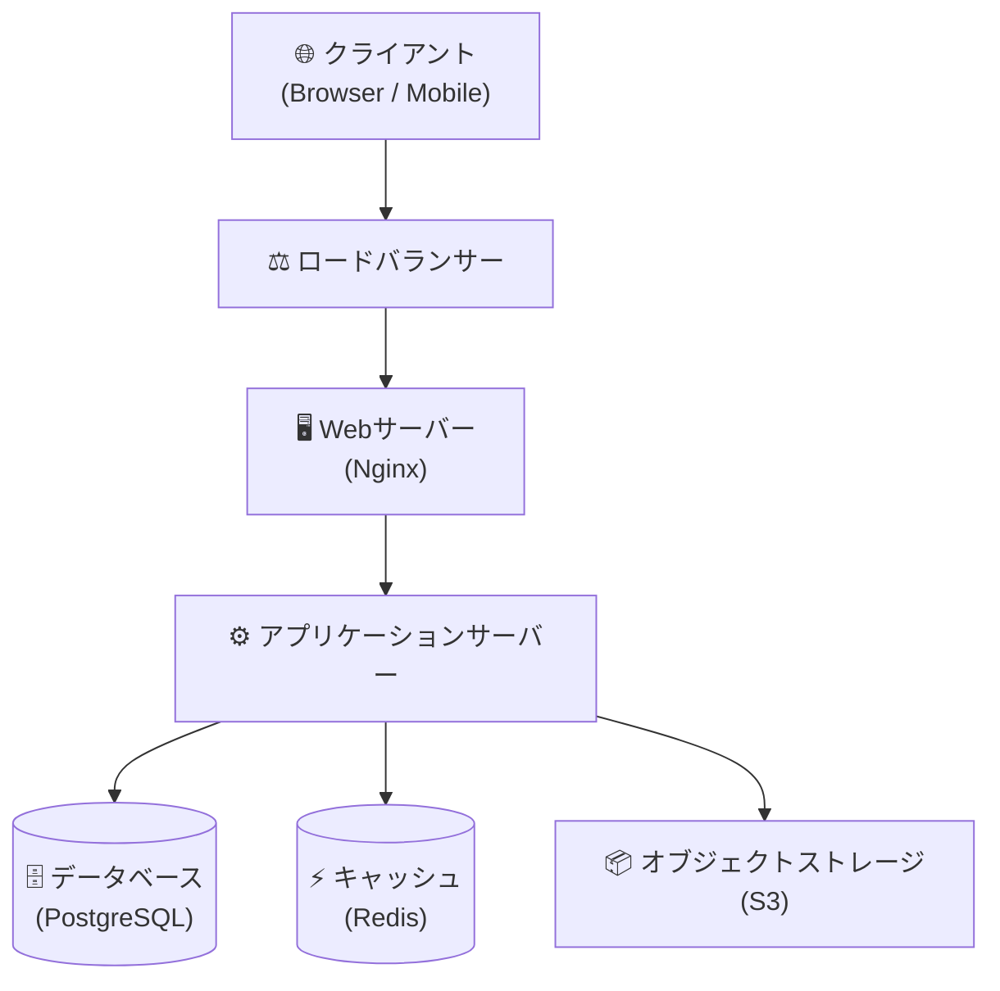
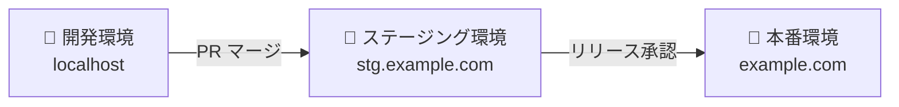

# システム設計書

## 1. システム概要

| 項目 | 内容 |
|---|---|
| システム名 | （システム名を記入） |
| バージョン | 1.0.0 |
| 作成日 | YYYY-MM-DD |
| 最終更新日 | YYYY-MM-DD |

## 2. アーキテクチャ概要

## 3. 技術スタック

### フロントエンド
| 項目 | 技術 | バージョン |
|---|---|---|
| フレームワーク | React | 18.x |
| 言語 | TypeScript | 5.x |
| スタイリング | Tailwind CSS | 3.x |

### バックエンド
| 項目 | 技術 | バージョン |
|---|---|---|
| 言語 | Node.js | 20.x |
| フレームワーク | Express | 4.x |
| ORM | Prisma | 5.x |

### インフラ
| 項目 | 技術 |
|---|---|
| クラウド | AWS |
| コンテナ | Docker / ECS |
| CI/CD | GitHub Actions |

## 4. 非機能要件

### 性能要件
- レスポンスタイム: 95パーセンタイルで 500ms 以内
- 同時接続数: 最大 1,000 ユーザー

### 可用性要件
- 稼働率: 99.9%（月次ダウンタイム 43分以内）
- RTO（目標復旧時間）: 1時間
- RPO（目標復旧時点）: 24時間

### セキュリティ要件
- 通信: HTTPS（TLS 1.2以上）
- 認証: JWT（有効期限 1時間）
- パスワード: bcrypt ハッシュ化

## 5. コンポーネント設計

### 認証モジュール
- ユーザー登録・ログイン・ログアウト
- JWTトークン発行・検証
- パスワードリセット

### （モジュール名）
- 機能1
- 機能2

## 6. デプロイ構成

## 7. 変更履歴

| バージョン | 日付 | 変更内容 | 担当者 |
|---|---|---|---|
| 1.0.0 | YYYY-MM-DD | 初版作成 | （名前） |
